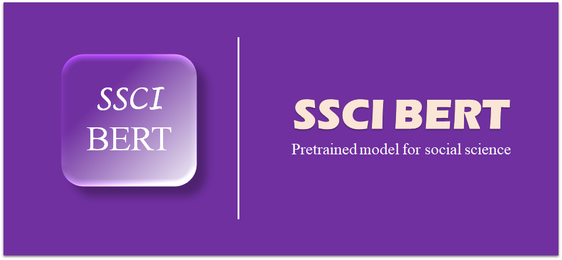

# SSCI-BERT: A pretrained language model for social scientific text



## Introduction

The research for social science texts needs the support natural language processing tools. 

The pre-training language model has greatly improved the accuracy of text mining in general texts. At present, there is an urgent need for a pre-training model specifically for the automatic processing of scientific texts in social science. 

We used the abstract of social science research as the training set. Based on the deep language model framework of BERT, we constructed SSCI-BERT and SSCI-SciBERT pre-training language models for intelligent processing tasks of social science text. 

We designed four downstream tasks of  Text Classification on different social scientific article corpus to verify the performance of the model.

- SSCI-BERT and SSCI-SciBERT are trained on the abstract of  articles published in SSCI journals from 1986 to 2021. The training set involved in the experiment included a total of `503910614 words`. 
- Based on the idea of Domain-Adaptive Pretraining, `SSCI-BERT` and `SSCI-SciBERT` combine a large amount of abstracts of scientific articles  based on the BERT structure, and continue to train the BERT and SSCI-SciBERT models respectively to obtain pre-training models for the automatic processing of Social science research texts. 


## News 

- 2022-03-24 : SSCIBERT and SSCI-SciBERT has been put forward for the first time.


##  How to use

### ~~Huggingface Transformers~~ (**This method is not open yet.**)

~~The `from_pretrained` method based on [Huggingface Transformers](https://github.com/huggingface/transformers) can directly obtain SSCI-BERT and SSCI-SciBERT models online.~~ 


- ~~SSCI-BERT~~

```python
from transformers import AutoTokenizer, AutoModel

tokenizer = AutoTokenizer.from_pretrained("SSCIBERT/SSCIabs-BERT-e2-y05")

model = AutoModel.from_pretrained("SSCIBERT/SSCIabs-SciBERT-e2-y05")
```

- ~~SSCI-SciBERT~~

```python
from transformers import AutoTokenizer, AutoModel

tokenizer = AutoTokenizer.from_pretrained("SSCIBERT/SSCIabs-SciBERT-e2-y05")

model = AutoModel.from_pretrained("SSCIBERT/SSCIabs-SciBERT-e2-y05")
```

### Download Models

- The version of the model we provide is `PyTorch`. 

### ~~From Huggingface~~ (**This method is not open yet.**)

- ~~Download directly through Huggingface's official website.~~ 
- ~~**SSCI-BERT: **~~ 

- ~~**SSCI-SciBERT: **~~

### From Google Drive

We have put the model on Google Drive for users. 

| Model                                                        | DATASET(year) | Base Model Trained on  |
| ------------------------------------------------------------ | ------------- | ---------------------- |
| [SSCIabs-BERT-e2-y05](https://drive.google.com/drive/folders/1ay--TuytZlkI45ub39oXOhXmZKX6rWO9?usp=sharing) | 2005-2021     | Bert-base-cased        |
| [SSCIabs-SciBERT-e2-y05](https://drive.google.com/drive/folders/15DHYetvoZ6j9Qa4EYw3fgZO8zoo_Avq8?usp=sharing) (recommended) | 2005-2021     | Scibert-scivocab-cased |
| [SSCIabs-BERT-e4-y05](https://drive.google.com/drive/folders/1TC_vvvcMnUo3VK_mVJ-HDwC68Ptyfxvf?usp=sharing) | 2005-2021     | Bert-base-cased        |
| [SSCIabs-SciBERT-e4-y05](https://drive.google.com/drive/folders/11IhmsbGmvB5zVYfjTZZzs2UImSwSRGkD?usp=sharing) (recommended) | 2005-2021     | Scibert-scivocab-cased |
| [SSCIabs-BERT-e2-y86](https://drive.google.com/drive/folders/1xEDnovlwGO2JxqCaf3rdjS2cB6DOxhj4?usp=sharing) | 1986-2021     | Bert-base-cased        |
| [SSCIabs-SciBERT-e2-y86](https://drive.google.com/drive/folders/16DtIvnHvbrR_92MwgthRRsULW6An9te1?usp=sharing) (recommended) | 1986-2021     | Scibert-scivocab-cased |
| [SSCIabs-BERT-e4-y86](https://drive.google.com/drive/folders/1sr6Av8p904Jrjps37g7E8aj4HnAHXSxW?usp=sharing) | 1986-2021     | Bert-base-cased        |
| [SSCIabs-SciBERT-e4-y86](https://drive.google.com/drive/folders/1ty-b4TIFu8FbilgC4VcI7Bgn_O5MDMVe?usp=sharing) | 1986-2021     | Scibert-scivocab-cased |

##  Evaluation & Results

- We use SSCI-BERT and SSCI-SciBERT to perform Text Classificationon different social science research corpus. The experimental results are as follows.

#### JCR Title Classify Dataset

| Model                  | accuracy | macro avg | weighted avg |
| ---------------------- | -------- | --------- | ------------ |
| Bert-base-cased        | 28.43    | 22.06     | 21.86        |
| Scibert-scivocab-cased | 38.48    | 33.89     | 33.92        |
| SSCIabs-BERT-e2-y05    | 40.17    | 35.23     | 35.15        |
| SSCIabs-SciBERT-e2-y05 | 42.04    | 37.5      | 37.65        |
| SSCIabs-BERT-e4-y05    | 40.39    | 35.36     | 35.29        |
| SSCIabs-SciBERT-e4-y05 | **42.7** | **38.23** | **38.38**    |
| SSCIabs-BERT-e2-y86    | 40.43    | 35.37     | 35.33        |
| SSCIabs-SciBERT-e2-y86 | 41.35    | 37.27     | 37.25        |
| SSCIabs-BERT-e4-y86    | 40.65    | 35.49     | 35.40        |
| SSCIabs-SciBERT-e4-y86 | 41.13    | 36.96     | 36.94        |
| Support                | 2300     | 2300      | 2300         |

#### JCR Abstract Classify Dataset

| Model                  | accuracy  | macro avg | weighted avg |
| ---------------------- | --------- | --------- | ------------ |
| Bert-base-cased        | 48.59     | 42.8      | 42.82        |
| Scibert-scivocab-cased | 55.59     | 51.4      | 51.81        |
| SSCIabs-BERT-e2-y05    | 57.27     | 52.83     | 53.02        |
| SSCIabs-SciBERT-e2-y05 | **60.18** | **56.64** | **57.21**    |
| SSCIabs-BERT-e4-y05    | 58.95     | 54.79     | 54.94        |
| SSCIabs-SciBERT-e4-y05 | 60.09     | 56.65     | 57.18        |
| SSCIabs-BERT-e2-y86    | 58.05     | 53.31     | 53.73        |
| SSCIabs-SciBERT-e2-y86 | 59.95     | 56.51     | 57.12        |
| SSCIabs-BERT-e4-y86    | 59.00     | 54.97     | 55.59        |
| SSCIabs-SciBERT-e4-y86 | 60.00     | 56.38     | 56.90        |
| Support                | 2200      | 2200      | 2200         |

#### SSCI Abstract Structural Function Recognition (Classify Dataset)

|              | Bert-base-cased            | SSCIabs-BERT-e2-y05        | SSCIabs-BERT-e4-y05        | SSCIabs-BERT-e2-y86        | SSCIabs-BERT-e4-y86        | support     |
| ------------ | -------------------------- | -------------------------- | -------------------------- | -------------------------- | -------------------------- | ----------- |
| B            | 63.77                      | 65.48                      | 63.61                      | 64.29                      | 64.63                      | 224         |
| P            | 53.66                      | 55.81                      | 57.3                       | 57.14                      | 57.99                      | 95          |
| M            | 87.63                      | 89.16                      | 89.16                      | 88.43                      | 89.06                      | 323         |
| R            | 86.81                      | 88.06                      | 88.37                      | 88.28                      | **88.47**                  | 419         |
| C            | 78.32                      | 79.88                      | 81.03                      | 79.82                      | 78.95                      | 316         |
| accuracy     | 79.59                      | 81.12                      | 81.26                      | 80.9                       | 80.97                      | 1377        |
| macro avg    | 74.04                      | 75.68                      | 75.9                       | 75.59                      | 75.82                      | 1377        |
| weighted avg | 79.02                      | 80.54                      | 80.7                       | 80.32                      | 80.44                      | 1377        |
|              | **Scibert-scivocab-cased** | **SSCIabs-SciBERT-e2-y05** | **SSCIabs-SciBERT-e4-y05** | **SSCIabs-SciBERT-e2-y86** | **SSCIabs-SciBERT-e4-y86** | **support** |
| B            | 69.98                      | **71.9**                   | 70.48                      | 70.95                      | 70.95                      | 224         |
| P            | 58.89                      | **60.49**                  | 57.95                      | 60.12                      | 58.96                      | 95          |
| M            | 89.37                      | 89.28                      | 88.85                      | **90.12**                  | 88.11                      | 323         |
| R            | 87.66                      | 86.18                      | 88.26                      | 88.07                      | 87.44                      | 419         |
| C            | 80.7                       | 82.32                      | **83.46**                  | 82.61                      | 82.94                      | 316         |
| accuracy     | 81.63                      | 82.14                      | 82.43                      | **82.72**                  | 82.06                      | 1377        |
| macro avg    | 77.32                      | 78.03                      | 77.8                       | **78.37**                  | 77.68                      | 1377        |
| weighted avg | 81.6                       | 81.93                      | 82.32                      | **82.58**                  | 81.92                      | 1377        |


## Cited

- If our content is helpful for your research work, please quote our research in your article. 
- If you want to quote our research, you can use this url (https://github.com/S-T-Full-Text-Knowledge-Mining/SSCI-BERT) as an alternative before our paper is published.

## Disclaimer

- The experimental results presented in the report only show the performance under a specific data set and hyperparameter combination, and cannot represent the essence of each model. The experimental results may change due to random number seeds and computing equipment. 
- **Users can use the model arbitrarily within the scope of the license, but we are not responsible for the direct or indirect losses caused by using the content of the project.** 


##  Acknowledgment

- SSCI-BERT was trained based on [BERT-Base-Cased]([google-research/bert: TensorFlow code and pre-trained models for BERT (github.com)](https://github.com/google-research/bert)).
- SSCI-SciBERT was trained based on [scibert-scivocab-cased]([allenai/scibert: A BERT model for scientific text. (github.com)](https://github.com/allenai/scibert))
